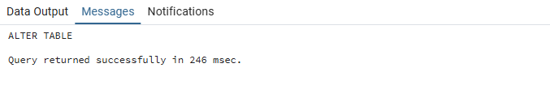
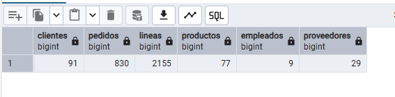
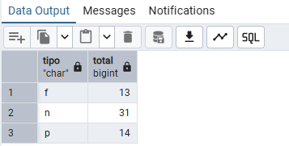
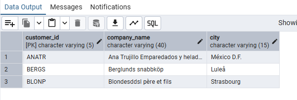
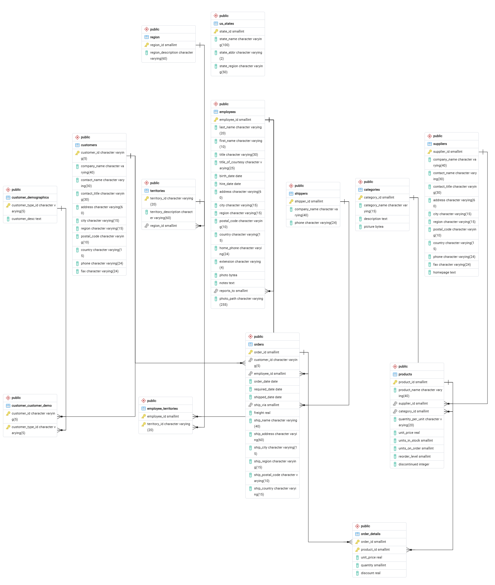

# Práctica SQL — Base de Datos Northwind

**Autora:** Sara Antón Madero

**Entorno Técnico:**
- **PostgreSQL:** 18
- **pgAdmin:** 18.6

## Instrucciones de despliegue

Para reproducir el entorno de esta práctica y cargar los datos correctamente, se han seguido estos pasos:

1. En pgAdmin (PostgreSQL 18), se ha creado una base de datos nueva y vacía llamada `northwind`.
2. Se ha abierto la *Query Tool* y se ha cargado el fichero proporcionado `northwind.sql`.
3. Se ha ejecutado el script correctamente y ha devuelto el mensaje de éxito `Query returned successfully`, confirmando que el entorno está listo.

## Validación de la base de datos

Tras la carga del script, se han realizado tres comprobaciones de seguridad para garantizar la integridad de los datos antes de comenzar el análisis:

1. **Volumen de datos:** Se verificó el número total de registros en las tablas principales (91 clientes, 830 pedidos, 2155 líneas de pedido, 77 productos, 9 empleados y 29 proveedores).

2. **Integridad referencial:** Se confirmó la correcta creación de las restricciones en la base de datos (14 Primary Keys, 13 Foreign Keys y 31 restricciones NOT NULL).

3. **Codificación:** Se comprobó que la base de datos está correctamente configurada en UTF-8, visualizando sin errores caracteres especiales y tildes en los nombres de empresas y ciudades (ej. México D.F., Luleå).

## Modelo de Datos (Diagrama ER)

A continuación se muestra el diagrama Entidad-Relación generado automáticamente por pgAdmin mediante ingeniería inversa, reflejando fielmente las 13 relaciones (claves ajenas) declaradas en el motor de la base de datos:

## Índice de Consultas

Todo el desarrollo técnico, incluyendo el código SQL, las capturas de resultado y las justificaciones de las 20 consultas requeridas, se encuentra en el siguiente documento:

--> **[Ver respuestas y consultas SQL](respuestas.md)**
