## Pregunta 1 — Catálogo comercial activo

**Enunciado:** Obtén los productos que no están descatalogados y cuyo precio unitario esté entre 10 y 50 euros, ambos incluidos. Muestra el nombre del producto y su precio redondeado a dos decimales, ordenado de mayor a menor precio.

**Consulta:**

```sql
-- Obtiene los productos activos con precio entre 10 y 50 euros, ordenados de mayor a menor precio
SELECT
       product_name AS producto, 
       ROUND(unit_price::numeric, 2) AS precio
FROM products
WHERE discontinued = 0 AND unit_price BETWEEN 10 AND 50
ORDER BY precio DESC;
```
**Captura:** 

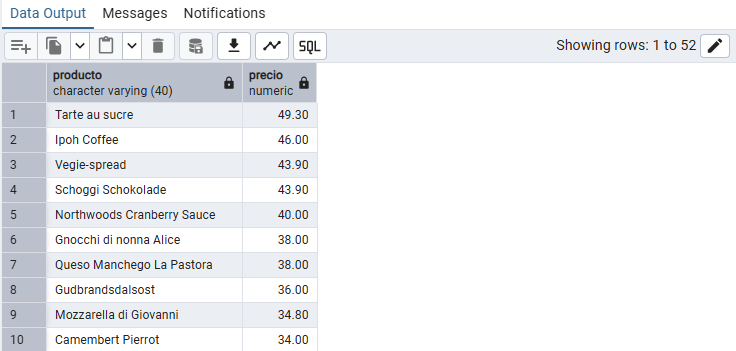

**Comentario:** He utilizado la función `ROUND` para que sólo devuelva dos decimales del precio. `unit_price` es de tipo real por eso se castea a numeric porque `ROUND` no acepta ese tipo de valor.

## Pregunta 2 — Concentración geográfica de la cartera

**Enunciado:** Dirección quiere saber en qué mercados está realmente concentrada la base de clientes antes de decidir dónde abrir delegación. Cuenta cuántos clientes hay en cada país y muestra únicamente aquellos países con **5 o más clientes**, ordenados de mayor a menor. Indica también cuántas ciudades distintas hay en cada uno de esos países.

**Consulta:**

```sql
-- Cuenta clientes y ciudades distintas por país, filtrando aquellos con 5 o más clientes
SELECT
       country AS pais,
       COUNT(customer_id) AS num_clientes,
       COUNT(DISTINCT city) AS num_ciudades
FROM customers
GROUP BY country
HAVING COUNT(customer_id) >= 5
ORDER BY num_clientes DESC;
```

**Captura:**

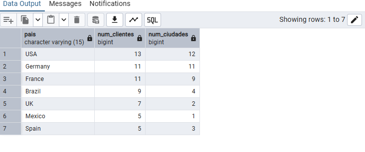

**Comentario:** Se usa `COUNT` con `customer_id` porque es un campo obligatorio que sí o sí tendrán todos los clientes. En el segundo `COUNT` se usa `DISTINCT` para que si hay una ciudad que se repite varias veces no la cuente varias veces. Se usa `HAVING` en vez de `WHERE` porque el filtro se está haciendo sobre una función de agregación.

## Pregunta 3 — Alerta de reposición

**Enunciado:** Logística necesita detectar qué referencias están en riesgo de rotura de stock. Localiza los productos activos cuyas unidades en stock sean **inferiores o iguales** a su nivel de reposición. Muestra el nombre, las unidades en stock, el nivel de reposición, las unidades ya pedidas al proveedor y una columna de texto que indique `'CRÍTICO'` cuando el stock sea 0 y `'AVISO'` en el resto de casos.

**Consulta:**

```sql
-- Devuelve aquellos productos con un bajo stock clasificándolos en dos grupos dependiendo de gravedad de la situación
SELECT 
    product_name   AS producto, 
    units_in_stock AS stock, 
    reorder_level  AS nivel_reposicion, 
    units_on_order AS pedido_a_proveedor,
    CASE 
        WHEN units_in_stock = 0 THEN 'CRÍTICO' 
        ELSE 'AVISO' 
    END AS situacion
FROM products
WHERE 
    discontinued = 0 
    AND units_in_stock <= reorder_level 
    AND units_in_stock IS NOT NULL 
    AND reorder_level IS NOT NULL;
```

**Captura:**

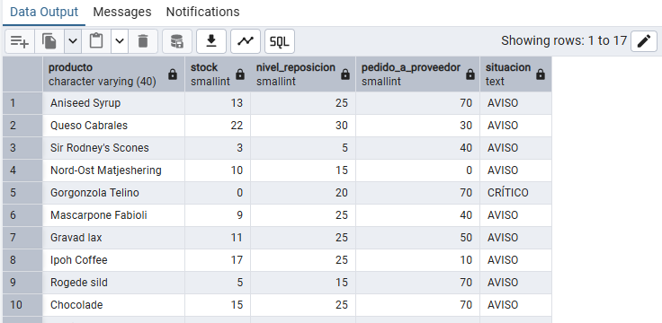

**Comentario:** Aunque `discontinued` funcione como un booleano, en la base de datos esta almacenado con integer. Por tanto, `discontinued = 0` es lo mismo que `discontinued = false`

## Pregunta 4 — Ficha completa de producto

**Enunciado:** Marketing va a rehacer el catálogo impreso y necesita cada producto con su categoría y los datos de contacto de quien lo suministra. Para los productos suministrados por empresas de **Italia, Francia o España**, muestra el nombre del producto, el nombre de la categoría, el nombre del proveedor, su país y su ciudad. Ordena por país y, dentro de cada país, por nombre de producto.

**Consulta:**

```sql
-- Devolver el catálogo de productos de empresas de Italia, Francia o España junto a una información básica
SELECT 
    p.product_name AS producto, 
    c.category_name AS categoria, 
    s.company_name AS proveedor, 
    s.country AS pais, 
    s.city AS ciudad
FROM products p
INNER JOIN categories c USING (category_id)
INNER JOIN suppliers s USING (supplier_id)
WHERE s.country IN ('Italy', 'France', 'Spain')
ORDER BY s.country ASC, p.product_name ASC;
```
**Captura:**

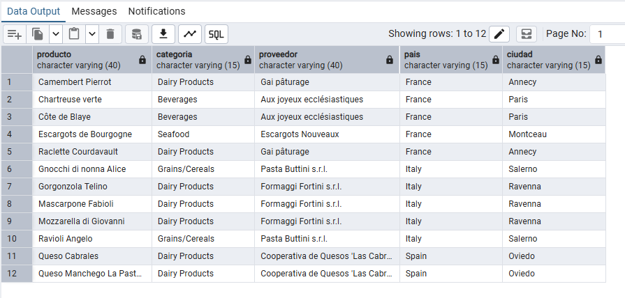

**Comentario:** En el `INNER JOIN` he utilizado `USING`, en vez de la opción larga de JOIN: `INNER JOIN categories c ON p.category_id = c.category_id`, porque al llamarse la columna igual en las dos tablas esta función es más rápida, además de que así aprovechaba para usar una función aprendida en los cursos de Datacamp.

## Pregunta 5 — Detalle valorizado de un pedido

**Enunciado:** Atención al cliente recibe una reclamación sobre el pedido **10248** y necesita reconstruir la factura línea a línea. Muestra, para ese pedido, el nombre del producto, el precio unitario aplicado, la cantidad, el descuento y el importe final de cada línea. Añade el nombre del cliente y la fecha del pedido.

**Consulta:**

```sql
-- Devolver toda la información de la factura asociada a el pedido 10248 por una incidencia
SELECT 
    c.company_name AS cliente, 
    o.order_date AS fecha_pedido, 
    p.product_name AS producto, 
    od.unit_price AS precio_unitario, 
    od.quantity AS cantidad, 
    od.discount AS descuento, 
    ROUND((od.unit_price::numeric) * od.quantity * (1 - od.discount::numeric), 2) AS importe_linea
FROM orders o
INNER JOIN customers c USING (customer_id)
INNER JOIN order_details od USING (order_id)
INNER JOIN products p USING (product_id)
WHERE o.order_id = 10248;
```
**Captura:**

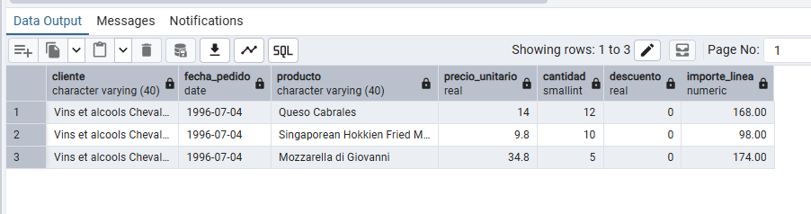

**Comentario:** La fórmula para calcular `importe_línea` es la proporcionada por el propio enunciado. Destacar que dentro de la función `ROUND` se pueden hacer cálculos matemáticos

## Pregunta 6 — Ranking de categorías por facturación

**Enunciado:** Comité de dirección: ¿qué familias de producto sostienen realmente el negocio? Calcula la facturación total de cada categoría durante toda la historia de la compañía. Muestra el nombre de la categoría, el número de líneas de pedido que ha generado, el número de productos distintos vendidos y la facturación total. Incluye únicamente las categorías que superen los **100.000 euros** de facturación, ordenadas de mayor a menor.

**Consulta:**

```sql
-- Devolver aquellas familias de productos que más generan a la empresa junto a cierta información requerida sobre las ventas
SELECT 
    c.category_name AS categoria, 
    COUNT(od.product_id) AS num_lineas, 
    COUNT(DISTINCT od.product_id) AS num_productos, 
    SUM(ROUND((od.unit_price::numeric) * od.quantity * (1 - od.discount::numeric), 2)) AS facturacion
FROM categories c
INNER JOIN products p USING (category_id)
INNER JOIN order_details od USING (product_id)
GROUP BY c.category_name
HAVING SUM(ROUND((od.unit_price::numeric) * od.quantity * (1 - od.discount::numeric), 2)) > 100000
ORDER BY facturacion DESC;
```
**Captura:**

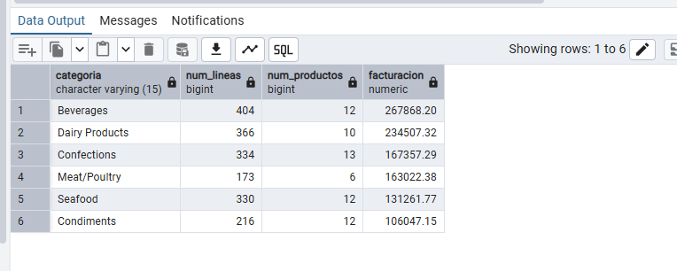

**Comentario:** Se puede aplicar la función `ROUND` directamente al resultado de una función de agregación como `SUM`. Lo que más problemas me ha causado en este ejercicio ha sido entender la jerarquía de las funciones (qué va dentro de qué) al calcular la facturación.

## Pregunta 7 — Clientes sin actividad comercial

**Enunciado:** Dirección comercial sospecha que hay cuentas abiertas que nunca han llegado a comprar. Lista **todos** los clientes con el número de pedidos que ha realizado cada uno y la fecha de su último pedido. Los clientes sin ningún pedido deben aparecer igualmente, con un 0 en el conteo y el texto `'SIN PEDIDOS'` en lugar de la fecha. Ordena de forma que los clientes inactivos aparezcan primero.

**Consulta:**

```sql
-- Localizar los clientes con cuenta pero que no realizaron ningún pedido
SELECT 
    c.company_name AS cliente, 
    c.country AS pais, 
    COUNT(o.order_id) AS num_pedidos, 
    COALESCE(MAX(o.order_date)::text, 'SIN PEDIDOS') AS ultimo_pedido
FROM customers c
LEFT JOIN orders o USING (customer_id)
GROUP BY c.company_name, c.country
ORDER BY num_pedidos ASC, c.company_name ASC;
```
**Captura:**

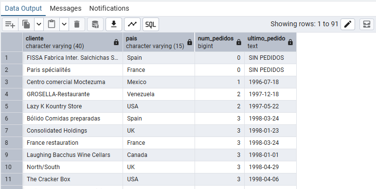

**Comentario:** Uso de función `COALESCE` que permite que los clientes que no hayan realizado pedidos también aparezcan. Además, esta función te permite añadir un texto alternativo para que no aparezca `null`; en este caso hemos definido el texto `SIN PEDIDOS`

## Pregunta 8 — Organigrama de la fuerza de ventas

**Enunciado:** Recursos Humanos necesita el organigrama del departamento comercial en formato tabla. Muestra cada empleado con su nombre completo, su cargo, el nombre completo de la persona a la que reporta y el cargo de esa persona. El empleado que no reporta a nadie debe aparecer también, con el texto `'DIRECCIÓN GENERAL'` en el campo del responsable.

**Consulta:**

```sql
-- Devolver el organigrama completo del departamento comercial 
SELECT 
    e.first_name || ' ' || e.last_name AS empleado, 
    e.title AS cargo, 
    COALESCE(m.first_name || ' ' || m.last_name, 'DIRECCIÓN GENERAL') AS responsable, 
    m.title AS cargo_responsable
FROM employees e
LEFT JOIN employees m ON e.reports_to = m.employee_id;
```
**Captura:**

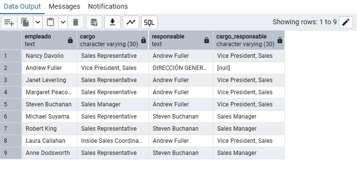

**Comentario:** Uso de la función `COALESCE` nuevamente y de los símbolos `||` para concatenar.

## Pregunta 9 — Rejilla de cobertura categoría × año

**Enunciado:** Control de gestión quiere una rejilla completa de facturación por categoría y año, **sin huecos**: si una categoría no vendió nada en un año concreto, debe aparecer con un 0, no desaparecer de la tabla. Genera todas las combinaciones posibles de las 8 categorías con los 3 años del histórico (24 filas) y asocia a cada combinación su facturación. Ordena por categoría y año.

**Consulta:**

```sql
-- Devolver las ventas de cada categoría en cada año
WITH anios AS (
    SELECT 1996 AS anio 
    UNION ALL 
    SELECT 1997 
    UNION ALL 
    SELECT 1998
),
ventas AS (
    SELECT 
        p.category_id, 
        EXTRACT(YEAR FROM o.order_date) AS anio, 
        SUM(ROUND((od.unit_price::numeric) * od.quantity * (1 - od.discount::numeric), 2)) AS total
    FROM orders o
    INNER JOIN order_details od USING (order_id)
    INNER JOIN products p USING (product_id)
    GROUP BY p.category_id, EXTRACT(YEAR FROM o.order_date)
)
SELECT 
    c.category_name AS categoria, 
    a.anio, 
    COALESCE(v.total, 0) AS facturacion
FROM categories c
CROSS JOIN anios a
LEFT JOIN ventas v ON c.category_id = v.category_id AND a.anio = v.anio
ORDER BY categoria ASC, anio ASC;
```
**Captura:**

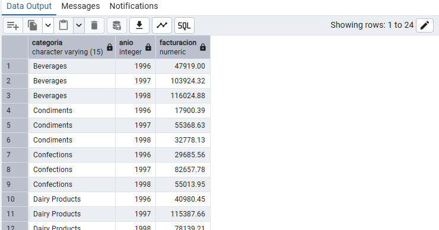

**Comentario:** Uso de `UNION ALL` para devolver los tres `SELECT` en un solo resultado. Estos `SELECT` no tienen clausula `FROM` porque no provienen de ninguna tabla. Uso de función `EXTRACT` para extraer de `o.order_date` sólo la información que nos interesa, que es el año. Por último se usa un `CROSS JOIN` porque necesitamos todas las combinaciones posibles.

## Pregunta 10 — Mapa de países: clientes frente a proveedores

**Enunciado:** Expansión internacional quiere una única tabla que muestre, para cada país en el que la compañía tiene presencia, cuántos clientes y cuántos proveedores hay. Deben aparecer los países que solo tienen clientes, los que solo tienen proveedores y los que tienen ambos.

**Consulta:**

```sql
-- Mostrar todos los países donde la empresa tiene clientes, proveedores o ambos junto a su cantidad
WITH clientes_pais AS (
    SELECT 
        country, 
        COUNT(customer_id) AS nc 
    FROM customers 
    GROUP BY country
),
proveedores_pais AS (
    SELECT 
        country, 
        COUNT(supplier_id) AS np 
    FROM suppliers 
    GROUP BY country
)
SELECT 
    COALESCE(c.country, p.country) AS pais,
    COALESCE(c.nc, 0) AS num_clientes, 
    COALESCE(p.np, 0) AS num_proveedores,
    CASE 
        WHEN c.nc IS NOT NULL AND p.np IS NOT NULL THEN 'AMBOS'
        WHEN c.nc IS NOT NULL THEN 'SOLO CLIENTES'
        ELSE 'SOLO PROVEEDORES' 
    END AS tipo_presencia
FROM clientes_pais c
FULL JOIN proveedores_pais p USING (country)
ORDER BY pais ASC;
```
**Captura:**

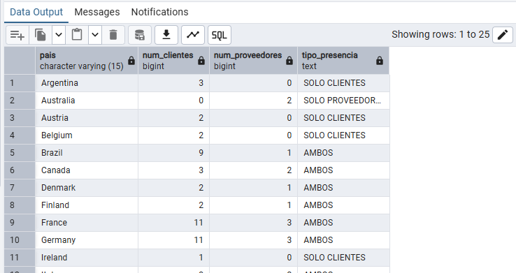

**Comentario:** Uso de la función `COALESCE` pero ahora, en vez de con un texto alternativo, con un valor alternativo: 0. Para la columna `tipo_presencia` se usa `CASE` para clasificar cada país dependiendo de clientes y proveedores.

## Pregunta 11 — Directorio unificado de contactos

**Enunciado:** Sistemas va a migrar el CRM y necesita una exportación única con todos los contactos de la compañía, vengan de donde vengan. Construye una sola tabla que reúna los contactos de clientes, los de proveedores y los empleados. Cada fila debe indicar el origen (`'CLIENTE'`, `'PROVEEDOR'`, `'EMPLEADO'`), el nombre de la persona de contacto **en mayúsculas**, la organización a la que pertenece, la ciudad y el país. Para los empleados, la organización es el literal `'NORTHWIND TRADERS'` y el nombre de contacto se forma concatenando nombre y apellidos. Ordena por origen y luego por país.

**Consulta:**

```sql
-- Devolver todos los contactos de la compañía
SELECT 'CLIENTE' AS origen, UPPER(contact_name) AS contacto, company_name AS organizacion, city AS ciudad, country AS pais FROM customers
UNION ALL
SELECT 'PROVEEDOR', UPPER(contact_name), company_name, city, country FROM suppliers
UNION ALL
SELECT 'EMPLEADO', UPPER(first_name || ' ' || last_name), 'NORTHWIND TRADERS', city, country FROM employees
ORDER BY origen ASC, pais ASC;
```
**Captura:**

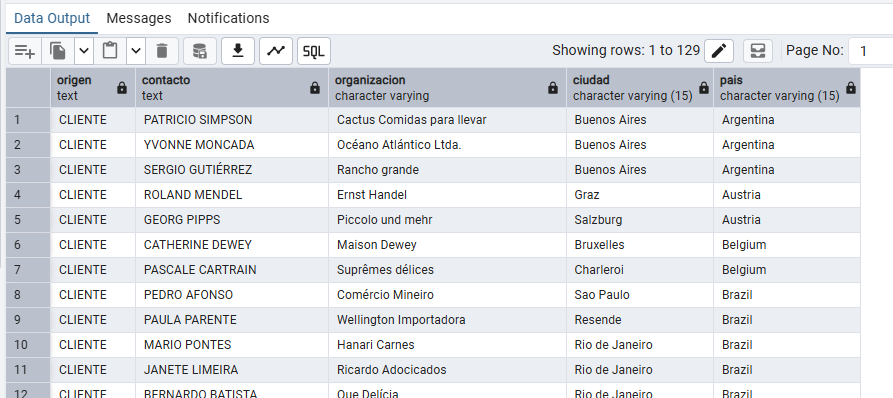

**Comentario:** Uso de función `UPPER` para que aparezca el texto en mayúsculas. Se usa `UNION ALL` para devolver en una las tres consultas. Cada fila tiene una celda introducida manualmente en la consulta para especificar 'CLIENTE', 'PROVEEDOR' o 'EMPLEADO'.

## Pregunta 12 — Mercados con desequilibrio

**Enunciado:** Compras y Ventas mantienen una discusión recurrente: ¿en qué países vendemos sin tener proveedor local, y en cuáles coincidimos? Resuelve las dos preguntas en dos consultas independientes:
**a)** Países donde hay clientes pero **ningún** proveedor.
**b)** Países donde hay **a la vez** clientes y proveedores.
Ordena ambos resultados alfabéticamente.

**Consulta:**

```sql
-- a) Países donde hay clientes pero ningún proveedor
SELECT country AS pais 
FROM customers
EXCEPT
SELECT country 
FROM suppliers
ORDER BY pais ASC;

-- b) Países donde hay a la vez clientes y proveedores
SELECT country AS pais 
FROM customers
INTERSECT
SELECT country 
FROM suppliers
ORDER BY pais ASC;
```
**Captura:**

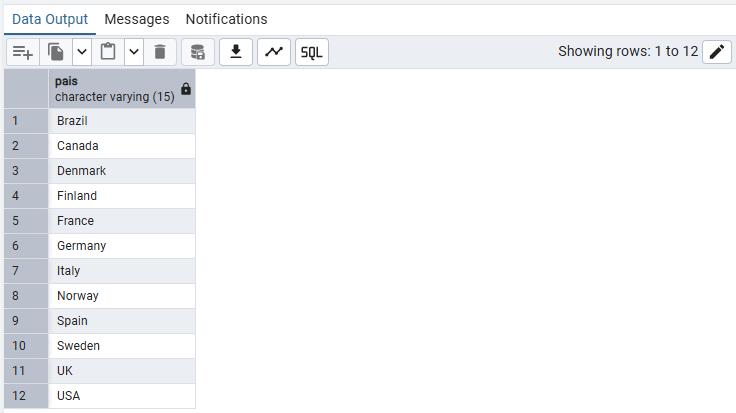

**Comentario:** el operador `EXCEPT` se usa para devolver solo los países que no aparecen en la segunda consulta también. `INTERSECT` funciona justamente al revés, devuelve los países que aparezcan en ambas consultas.

## Pregunta 13 — Clientes que nunca han comprado pescado

**Enunciado:** El responsable de la categoría Seafood quiere una lista de cuentas sobre las que hacer campaña de captación. Localiza los clientes que **nunca** han incluido un producto de la categoría `'Seafood'` en ninguno de sus pedidos. Muestra el nombre del cliente, su país y el número total de pedidos que sí ha realizado, de mayor a menor.

**Consulta:**

```sql
-- Devolver aquellos clientes que nunca han pedido un producto de la categoría seafood 
SELECT 
    c.company_name AS cliente, 
    c.country AS pais, 
    COUNT(o.order_id) AS pedidos_realizados
FROM customers c
LEFT JOIN orders o USING (customer_id)
WHERE 
    NOT EXISTS (
        SELECT 1 
        FROM orders o2 
        INNER JOIN order_details od USING (order_id) 
        INNER JOIN products p USING (product_id) 
        INNER JOIN categories cat USING (category_id)
        WHERE o2.customer_id = c.customer_id AND cat.category_name = 'Seafood'
    )
GROUP BY c.company_name, c.country
ORDER BY pedidos_realizados DESC;
```
**Captura:**

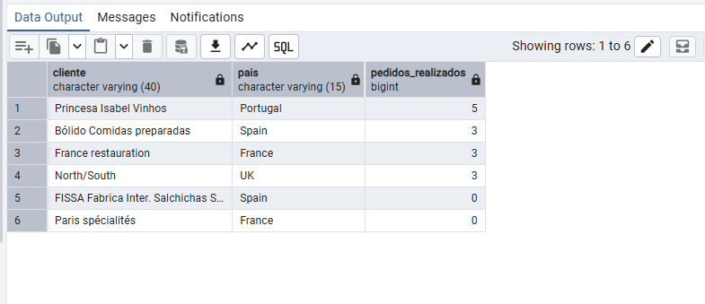

**Comentario:** `NOT EXISTS` evalúa si la subconsulta encuentra registros o no. En este caso solo se incluirán resultados donde esa consulta no devuelva ninguna fila . En el `SELECT` de la subconsulta se usa un 1 en vez de un * o columnas específicas por una cuestión de optimización; es indiferente lo que devuelva, lo importante es si devuelve o no algo.

## Pregunta 14 — Productos por encima de la media

**Enunciado:** El comité de precios quiere identificar el segmento premium del catálogo. Muestra los productos activos cuyo precio unitario supere el precio medio de **todo** el catálogo. Incluye en cada fila el precio del producto, el precio medio general y la diferencia entre ambos, todo redondeado a dos decimales. Ordena por diferencia descendente.

**Consulta:**

```sql
-- Localizar aquellos productos que, por su alto precio, se consideran premium y la diferencia que tienen con la media del catálogo
SELECT 
    product_name AS producto, 
    ROUND(unit_price::numeric, 2) AS precio,
    ROUND((SELECT AVG(unit_price)::numeric FROM products WHERE discontinued = 0), 2) AS precio_medio_catalogo,
    ROUND(unit_price::numeric - (SELECT AVG(unit_price)::numeric FROM products WHERE discontinued = 0), 2) AS diferencia
FROM products 
WHERE discontinued = 0 AND unit_price > (SELECT AVG(unit_price) FROM products WHERE discontinued = 0)
ORDER BY diferencia DESC;
```
**Captura:**

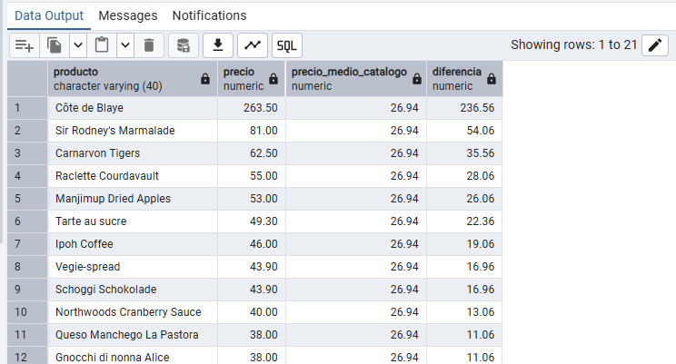

**Comentario:** Destacar de este ejercicio que se puede aplicar `ROUND` directamente al resultado de una subconsulta. No lo sabía, es algo que tuve que buscar para realizar este ejercicio.

## Pregunta 15 — Ticket medio por cliente

**Enunciado:** Dirección comercial quiere segmentar la cartera por valor medio de pedido, no por volumen total. Calcula, para cada cliente que haya comprado alguna vez, el número de pedidos, el importe total acumulado y el importe medio por pedido. Muestra los 15 clientes con mayor ticket medio. El cálculo tiene dos niveles: primero hay que obtener el importe de cada pedido sumando sus líneas, y solo después promediar esos importes por cliente. **Promediar directamente las líneas daría un resultado distinto y equivocado.**

**Consulta:**

```sql
-- Calcula, para cada cliente que haya comprado alguna vez, el número de pedidos, el importe total acumulado y el importe medio por pedido
SELECT 
    c.company_name AS cliente, 
    c.country AS pais, 
    COUNT(t.order_id) AS num_pedidos,
    SUM(t.total_pedido) AS importe_total, 
    ROUND(AVG(t.total_pedido), 2) AS ticket_medio
FROM customers c
INNER JOIN (
    SELECT 
        o.customer_id, 
        o.order_id, 
        SUM(ROUND((od.unit_price::numeric) * od.quantity * (1 - od.discount::numeric), 2)) AS total_pedido
    FROM orders o
    INNER JOIN order_details od USING (order_id)
    GROUP BY o.customer_id, o.order_id
) t USING (customer_id)
GROUP BY c.company_name, c.country
ORDER BY ticket_medio DESC
LIMIT 15;
```
**Captura:**

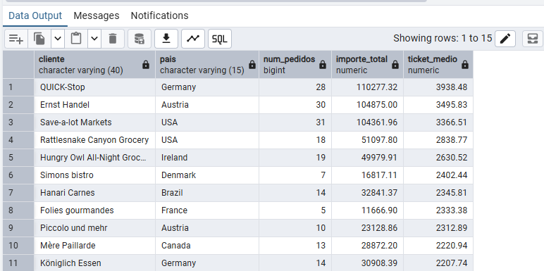

**Comentario:** Para esta consulta he tenido que recurrir a la inteligencia artificial para la parte de la subconsulta dentro del `INNER JOIN`, me cuesta mucho entender como funciona.

## Pregunta 16 — El producto más caro de cada categoría

**Enunciado:** El equipo de compras quiere revisar el posicionamiento de precio en cada familia. Para cada categoría, muestra el producto con el precio unitario más alto. Incluye el nombre de la categoría, el nombre del producto, su precio y el precio medio de su categoría. Resuélvelo con una **subconsulta correlacionada**: para cada producto, comprueba si su precio coincide con el máximo de su propia categoría.

**Consulta:**

```sql
-- Devuelve de cada categoría el producto más caro junto a su precio y el precio medio de su categoría
SELECT 
    c.category_name AS categoria, 
    p.product_name AS producto, 
    ROUND(p.unit_price::numeric, 2) AS precio,
    ROUND((SELECT AVG(unit_price)::numeric FROM products p3 WHERE p3.category_id = p.category_id), 2) AS precio_medio_categoria
FROM products p
INNER JOIN categories c USING (category_id)
WHERE 
    p.unit_price = (
        SELECT MAX(unit_price) 
        FROM products p2 
        WHERE p2.category_id = p.category_id
    );
```
**Captura:**

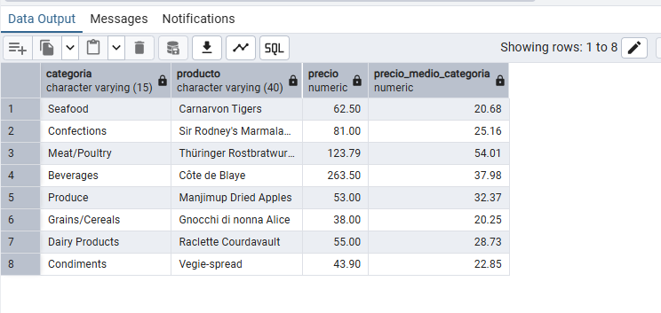

**Comentario:** Subconsulta en el `WHERE` para cumplir con lo especificado en el enunciado. Compara si `unit_price` es igual al máximo de su propia categoría.

## Pregunta 17 — Segmentación ABC de la cartera de clientes

**Enunciado:** Dirección quiere clasificar a los clientes en tres tramos de valor para asignar recursos comerciales. Usando expresiones de tabla común (CTE), construye una consulta que:
1. Calcule la facturación total de cada cliente.
2. Divida los clientes en **cuartiles** según esa facturación.
3. Asigne una etiqueta de segmento: `'A - Estratégico'` al cuartil superior, `'B - Consolidado'` al segundo, `'C - Ocasional'` al tercero y `'D - Marginal'` al cuarto.
4. Devuelva, por segmento, el número de clientes, la facturación total del segmento y el porcentaje que representa sobre el total de la compañía.

**Consulta:**

```sql
-- Clasifica a los clientes en grupos según su facturación
WITH VentasClientes AS (
    SELECT o.customer_id, SUM(ROUND((od.unit_price::numeric) * od.quantity * (1 - od.discount::numeric), 2)) AS facturacion
    FROM orders o 
    INNER JOIN order_details od USING (order_id) 
    GROUP BY o.customer_id
),
Cuartiles AS (
    SELECT 
        customer_id, 
        facturacion, 
        NTILE(4) OVER (ORDER BY facturacion DESC) as cuartil 
    FROM VentasClientes
),
Segmentos AS (
    SELECT 
        customer_id,
        CASE cuartil 
            WHEN 1 THEN 'A - Estratégico' 
            WHEN 2 THEN 'B - Consolidado' 
            WHEN 3 THEN 'C - Ocasional' 
            WHEN 4 THEN 'D - Marginal' 
        END AS segmento, 
        facturacion 
    FROM Cuartiles
)
SELECT 
    segmento, 
    COUNT(customer_id) AS num_clientes, 
    SUM(facturacion) AS facturacion_segmento,
    ROUND(SUM(facturacion) / (SELECT SUM(facturacion) FROM Segmentos) * 100, 2) AS porcentaje_sobre_total
FROM Segmentos 
GROUP BY segmento 
ORDER BY segmento ASC;
```
**Captura:**

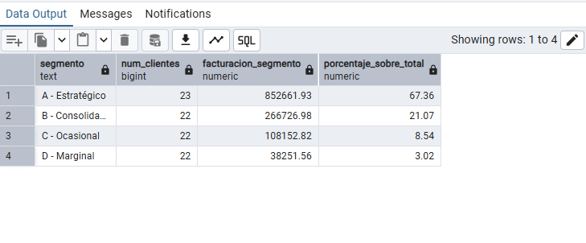

**Comentario:**  `NTILE` es una función de ventana en SQL que divide un conjunto de filas, en esta caso hemos especificado que lo haga en cuatro conjuntos. `ORDER BY` aquí lo que hace es indicarle cómo debe ordenar los datos antes de repartirlos en esos 4 grupos.

## Pregunta 18 — Los tres productos más vendidos de cada categoría

**Enunciado:** El equipo de categoría necesita el podio de cada familia para negociar con proveedores. Para cada categoría, obtén los **tres productos con mayor facturación**. Muestra la categoría, la posición dentro de la categoría, el nombre del producto, las unidades vendidas y la facturación. Incluye además una columna con la posición global del producto en el conjunto de la compañía, para que se vea qué productos son líderes de su nicho pero irrelevantes en el total.

**Consulta:**

```sql
-- Devuelve los tres productos de mayor facturación de cada categoría e incluye su posición global
WITH VentasProd AS (
    SELECT 
        p.category_id, 
        p.product_id, 
        p.product_name AS producto, 
        SUM(od.quantity) AS unidades,
        SUM(ROUND((od.unit_price::numeric) * od.quantity * (1 - od.discount::numeric), 2)) AS facturacion
    FROM products p 
    INNER JOIN order_details od USING (product_id) 
    GROUP BY p.category_id, p.product_id, p.product_name
),
Rankings AS (
    SELECT 
        c.category_name AS categoria, 
        v.producto, 
        v.unidades, 
        v.facturacion,
        RANK() OVER (PARTITION BY v.category_id ORDER BY v.facturacion DESC) AS posicion_en_categoria,
        RANK() OVER (ORDER BY v.facturacion DESC) AS posicion_global
    FROM VentasProd v 
    INNER JOIN categories c USING (category_id)
)
SELECT 
    categoria, 
    posicion_en_categoria, 
    producto, 
    unidades, 
    facturacion, 
    posicion_global
FROM Rankings 
WHERE posicion_en_categoria <= 3 
ORDER BY categoria ASC, posicion_en_categoria ASC;
```
**Captura:**

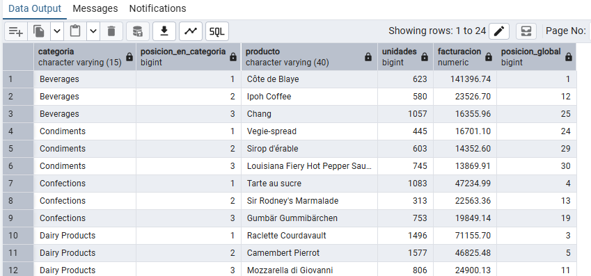

**Comentario:** `RANK` se usa para crear rankings. En el caso de su primer uso en esta consulta usa `PARTITION BY` que lo que hace es dividir en grupos según la categoría lo que hace que el ranking se calcule de forma independiente dentro de cada categoría.

## Pregunta 19 — Evolución mensual con acumulado y media móvil

**Enunciado:** Control de gestión prepara el cuadro de mando de la evolución del negocio durante 1997. Para cada mes de 1997, calcula:
- La facturación del mes.
- El total acumulado desde enero.
- La media móvil de los tres últimos meses (el mes actual y los dos anteriores).
- La facturación del mes anterior.
- La variación porcentual respecto al mes anterior.

**Consulta:**

```sql
-- Devolver un análisis de la evolución del negocio durante 1997
WITH VentasMes AS (
    SELECT 
        DATE_TRUNC('month', o.order_date)::date AS mes,
        SUM(ROUND((od.unit_price::numeric) * od.quantity * (1 - od.discount::numeric), 2)) AS facturacion
    FROM orders o 
    INNER JOIN order_details od USING (order_id) 
    WHERE EXTRACT(YEAR FROM o.order_date) = 1997 
    GROUP BY DATE_TRUNC('month', o.order_date)::date
)
SELECT 
    mes, 
    facturacion,
    SUM(facturacion) OVER (ORDER BY mes) AS acumulado,
    ROUND(AVG(facturacion) OVER (ORDER BY mes ROWS BETWEEN 2 PRECEDING AND CURRENT ROW), 2) AS media_movil_3m,
    LAG(facturacion) OVER (ORDER BY mes) AS mes_anterior,
    ROUND((facturacion - LAG(facturacion) OVER (ORDER BY mes)) / LAG(facturacion) OVER (ORDER BY mes) * 100, 2) AS variacion_pct
FROM VentasMes 
ORDER BY mes ASC;
```
**Captura:** 

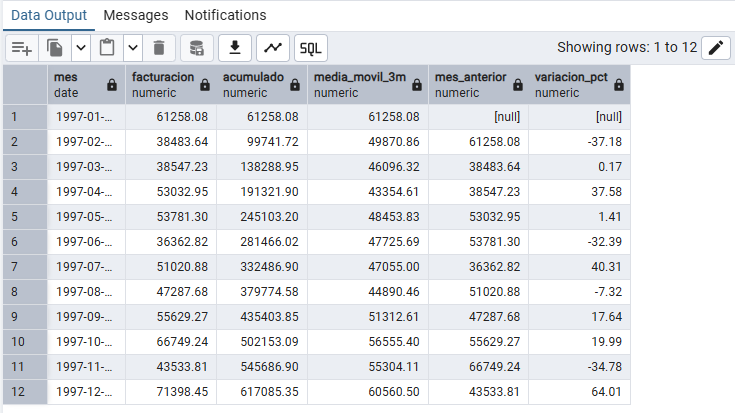

**Comentario:** Se usa `DATA_TRUNC` para obtener el mes de una fecha que contiene más datos. `En media_movil_3m` se usa una función de venta que devuelve el mes anterior y los dos siguientes. La función `LAG()`, que se usa varias veces en esta consulta, lo que hace es recuperar un valor anterior. Por ejemplo, se usa en `mes_anterior`, donde precisamente devuelve la facturación del mes anterior. 

## Pregunta 20 — Cuadro de mando anual por categoría

**Enunciado:** Última petición, y la más ambiciosa: el informe anual que se presenta al consejo. Construye una tabla donde cada fila sea una categoría y las columnas muestren la facturación de 1996, 1997 y 1998 en columnas separadas, más el total de los tres años. Añade al final una fila de totales generales. Incluye además una columna que indique el peso de cada categoría sobre la facturación total de la compañía, y otra que muestre si la categoría creció o decreció entre 1997 y 1998.

**Consulta:**

```sql
-- Devuelve un informe anual de la empresa con la facturación de 1996, 1997 y 1998 estudiando su tendencia en el último año
WITH VentasCategoria AS (
    SELECT 
        c.category_name AS categoria,
        SUM(ROUND((od.unit_price::numeric) * od.quantity * (1 - od.discount::numeric), 2)) FILTER (WHERE EXTRACT(YEAR FROM o.order_date) = 1996) AS f_1996,
        SUM(ROUND((od.unit_price::numeric) * od.quantity * (1 - od.discount::numeric), 2)) FILTER (WHERE EXTRACT(YEAR FROM o.order_date) = 1997) AS f_1997,
        SUM(ROUND((od.unit_price::numeric) * od.quantity * (1 - od.discount::numeric), 2)) FILTER (WHERE EXTRACT(YEAR FROM o.order_date) = 1998) AS f_1998,
        SUM(ROUND((od.unit_price::numeric) * od.quantity * (1 - od.discount::numeric), 2)) AS total
    FROM categories c 
    INNER JOIN products p USING (category_id) 
    INNER JOIN order_details od USING (product_id) 
    INNER JOIN orders o USING (order_id)
    GROUP BY ROLLUP(c.category_name)
)
SELECT 
    COALESCE(categoria, 'TOTAL GENERAL') AS categoria,
    COALESCE(f_1996, 0) AS f_1996, 
    COALESCE(f_1997, 0) AS f_1997, 
    COALESCE(f_1998, 0) AS f_1998, 
    COALESCE(total, 0) AS total,
    ROUND(total / MAX(total) OVER () * 100, 2) AS peso_pct,
    CASE 
        WHEN categoria IS NULL THEN NULL
        WHEN f_1998 > f_1997 THEN 'CRECE'
        WHEN f_1998 < f_1997 THEN 'DECRECE'
        ELSE 'MANTIENE' 
    END AS tendencia
FROM VentasCategoria 
ORDER BY 
    CASE 
        WHEN categoria IS NULL THEN 1 
        ELSE 0 
    END, 
    total DESC;
```
**Captura:**

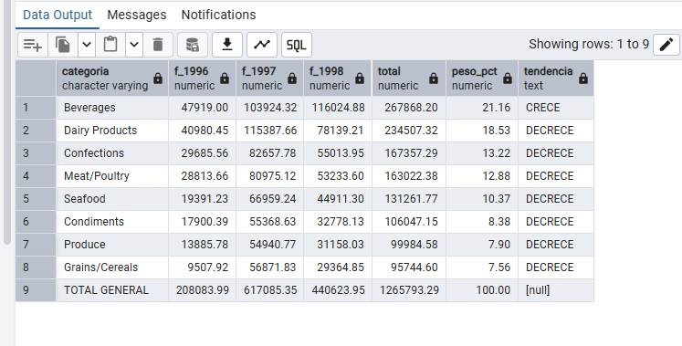

**Comentario:** La función `FILTER` te permite aplicar una condición WHERE únicamente a una función de agregación específica. En este caso, a la función `SUM`. En este ejercicio, también se podría resolver con un `CASE`, pero es algo más denso.
